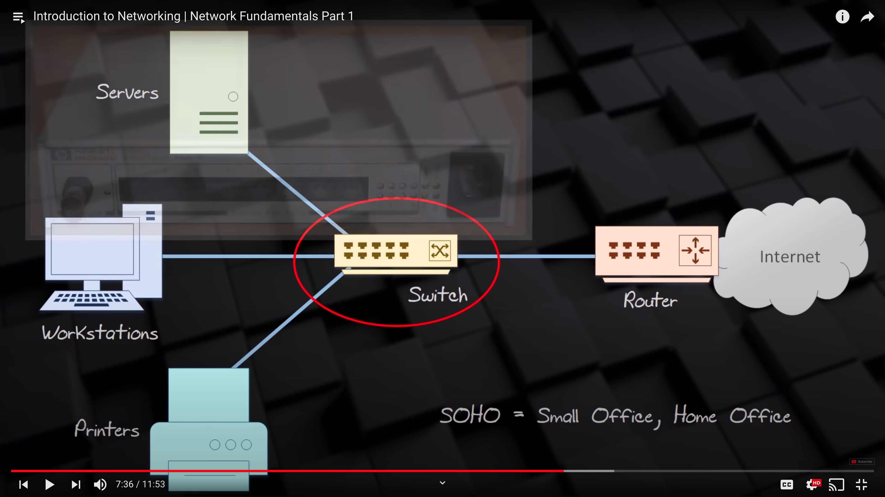
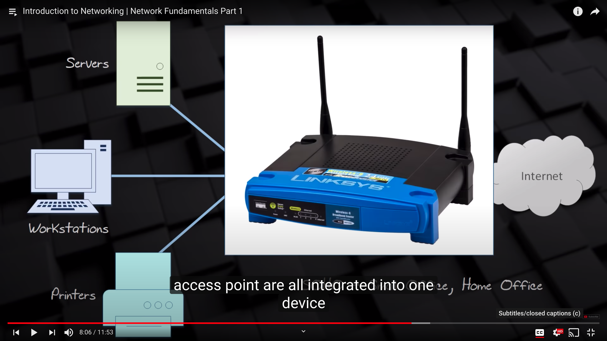
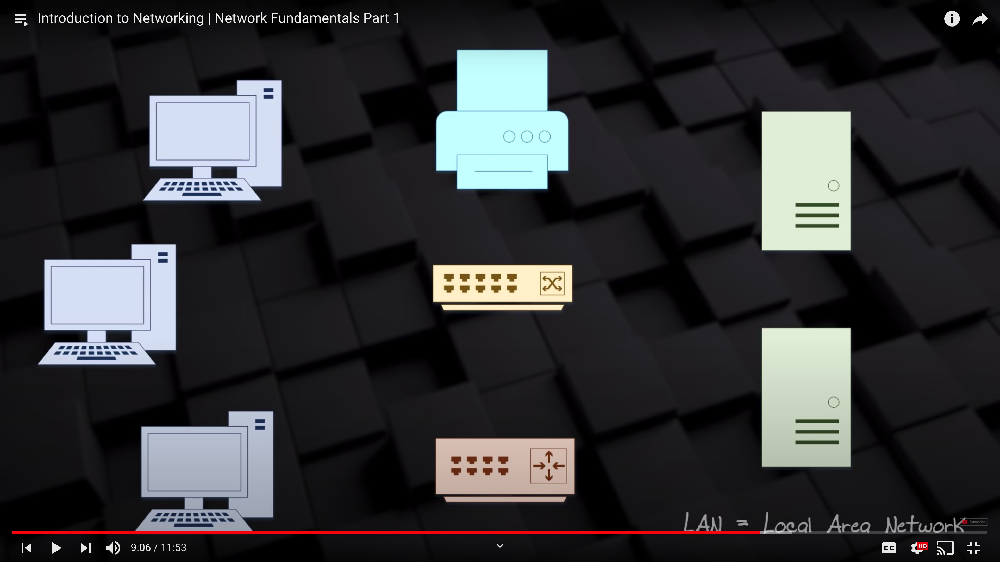
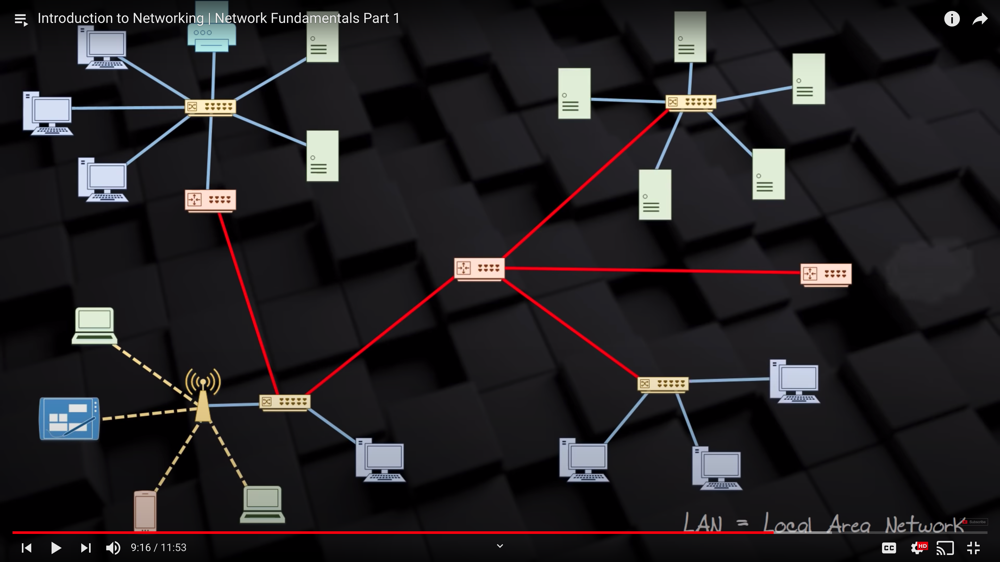

# Introduction to Networking | Network Fundamentals Part 1

General types of connections:

+ **Switch**: wired
+ **Access Point**: wireless. 
  + The assess point is like a switch without cables
  + AP can also be connected to a Switch, such that they are in the same network
+ Protocols:
  + Ethernet
  + TCP 

